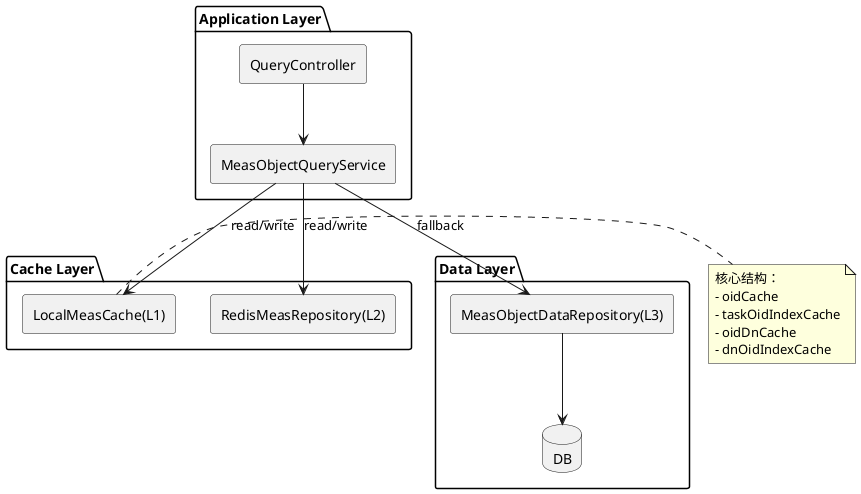
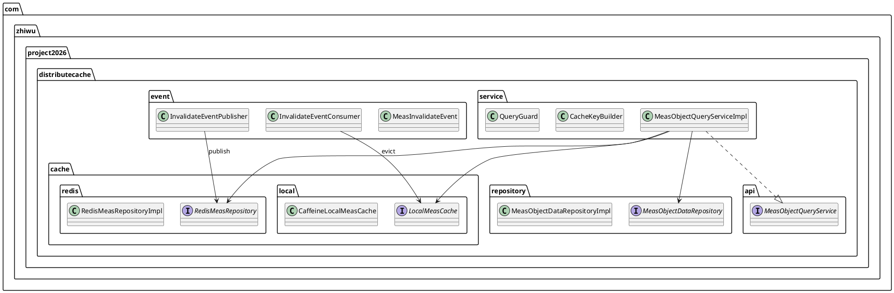
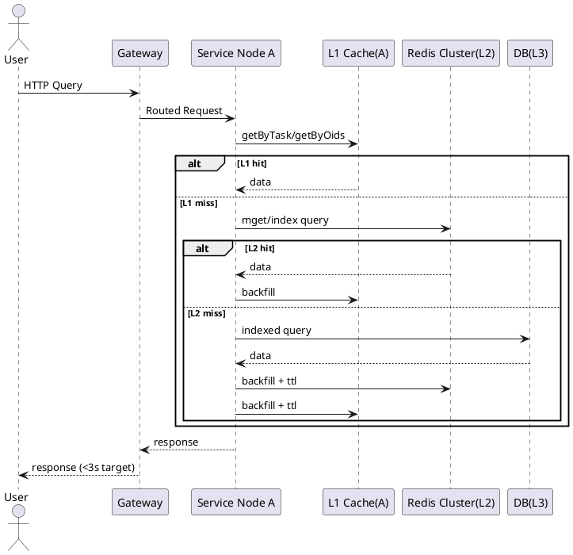
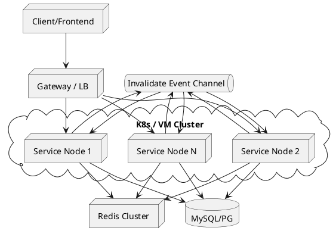
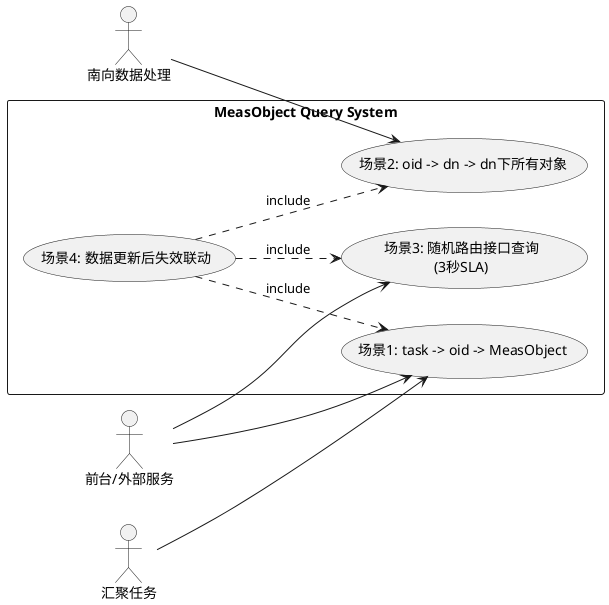

# 测量对象分层缓存改造设计文档（应用本地缓存 + 分布式缓存）

## 1. 背景与问题
当前各节点都全量持有测量对象（`MeasObject`）数据，随着数据量增长出现：

1. 节点内存线性膨胀，扩容后总内存浪费更严重。
2. 发布/重启时加载慢，冷启动风险高。
3. 多节点重复持有全量对象，限制后续水平扩展。

相关模型：

1. `src/main/java/com/zhiwu/project2026/distributecache/model/TaskModel.java`
2. `src/main/java/com/zhiwu/project2026/distributecache/model/ManageObject.java`
3. `src/main/java/com/zhiwu/project2026/distributecache/model/MeasObject.java`

---

## 2. 设计目标

1. 节点不再持有全量测量对象，仅缓存“本节点热数据”。
2. 查询延迟接近内存访问，Redis 作为跨节点共享缓存。
3. 支持三类流量：南向接收、汇聚任务、接口查询。
4. 数据更新后可在秒级完成多节点一致性收敛。
5. Redis 或单节点异常时具备降级能力。
6. 前台查询接口在随机路由下满足 3 秒内响应（P99 <= 3s）。

---

## 3. 总体架构
采用 **L1 本地缓存 + L2 Redis + L3 DB** 三层读路径：

### 3.1 L1（进程内本地缓存）
- 推荐 Caffeine（按条目数/权重 + TTL + 访问淘汰）。
- 仅缓存热点 `MeasObject`、任务索引结果。
- 目标命中率：南向/汇聚核心路径 > 95%。

### 3.2 L2（分布式缓存）
- Redis Cluster。
- 保存 `MeasObject` 主数据、索引映射、版本号。
- 通过 Pub/Sub 或 Stream 推送失效事件。

### 3.3 L3（持久层）
- DB 为最终一致来源。
- Cache miss 时回源并回填 L2/L1。

### 3.4 主链路原则（必须）
- 核心主链路固定为 `L1 -> L2 -> DB`，不因任何优化策略改变。
- 所有优化（如查询亲和路由）仅用于提高命中率和降低延迟，不能替代 L2 共享缓存和 DB 回源能力。
- 全链路必须执行 3 秒 SLA 约束、超时控制与降级策略。

---

## 4. 缓存数据模型与 Key 设计
基于现有字段（`dn`、`originalValue`、`moType`、`taskKey`）建议：

1. `meas:{moType}:{dn}:{originalValue}` -> `MeasObject` JSON
2. `meas:oid:{oid}` -> `MeasObject` JSON（任务查询优先路径）
3. `idx:oid-dn:{oid}` -> `dn`（辅助映射）
4. `idx:dn-oids:{dn}` -> `Set<oid>`（dn 下对象索引）
5. `idx:task-oids:{taskKey}:{moType}` -> `Set<oid>`（由任务 `mos` 字段提取）
6. `idx:dn:{dn}` -> `Set<measKey>`（兼容历史路径）
7. `idx:task:{taskKey}:{moType}` -> `Set<measKey>`（兼容历史路径）
8. `ver:meas:{moType}:{dn}` -> `long`（版本号）
9. `evt:meas:invalidate`（频道/Stream，推送变更 key + 版本）

说明：

- `MeasObject` 注释提示 `dn + originalValue` 唯一，可作为主查询维度。
- 当前任务模型新增 `mos` 并记录绑定 `oid`，建议将 `oid` 查询路径作为在线主路径。
- 为避免内存重复，建议缓存“索引 + 单对象”，避免直接缓存 `dn -> List<MeasObject>`。

---

## 5. 核心流程

### 5.1 读流程（统一）

1. 查 L1（Caffeine）。
2. miss 查 L2（Redis）。
3. miss 查 DB，写回 L2，再写 L1。
4. 空值穿透防护：L1/L2 写短 TTL 空对象（如 30s）。

### 5.2 写流程（新增/更新/删除）

1. 先写 DB（事务成功后继续）。
2. 删除/更新 L2 主 key 与索引。
3. 发布失效事件（含 key + version + opType）。
4. 各节点订阅后清理 L1 对应条目。

### 5.3 三类业务场景

1. 南向数据（按 `dn` 路由）：优先使用 `idx:dn:{dn}` -> 批量取 `measKey`。
2. 汇聚任务（按 `taskKey + moType` 路由）：使用 `idx:task:{taskKey}:{moType}`。
3. 对外接口（负载均衡随机到节点）：强依赖 L2 共享缓存保证跨节点命中。

### 5.4 前台与外部服务查询场景（随机路由 + 高时效）

1. 读路径固定为 L1 -> L2 -> DB，禁止接口层做全量预加载。
2. 前台查询强制分页（如 `pageSize <= 200`），避免单次返回过大导致 3 秒超时。
3. 接口按“查询条件模板”构建缓存 key（包含 `moType`、过滤条件、分页参数），命中后直接返回结果页。
4. 对热点查询条件做主动预热（启动预热 + 定时预热 + 流量探测预热）。
5. 支持并行批量取数（Redis pipeline / mget），减少网络往返。
6. 当预计超时（例如 2.5 秒）触发保护：返回缓存快照或降级数据，并附带数据时间戳。

### 5.5 任务查询优化场景（`task -> oid -> measObject`）

背景：任务中新增 `mos` 字段，`mos` 记录绑定 `oid`，因此查询时优先按 `oid` 获取测量对象。

本地缓存（L1）建议结构：

1. `oidCache`: `oid -> MeasObject`（核心缓存，最高优先级）。
2. `taskOidIndexCache`: `taskKey(+moType) -> List<oid>`（从任务 `mos` 提取）。
3. `oidDnCache`: `oid -> dn`（支持部分任务的 `oid -> dn` 过程）。
4. `dnOidIndexCache`: `dn -> List<oid>`（用于按 dn 批量取对象）。

读取路径 A（常规任务）：

1. 通过 `taskOidIndexCache` 获取任务对应 `oid` 列表。
2. 批量查询 `oidCache`（`getAllPresent`）。
3. 对 miss 的 `oid` 批量查询 L2，必要时回源 DB 并回填 L2/L1。

读取路径 B（需要 `oid -> dn -> dn全量` 的任务）：

1. 先批量查询 `oidDnCache` 得到 dn。
2. 按 dn 分组后查询 `dnOidIndexCache`。
3. 再通过 `oidCache` 批量获取 `MeasObject`，避免按 dn 直接缓存对象列表。

收益：

1. 查询主链路由 `task -> oid -> object` 缩短，降低延迟。
2. 避免同一对象在多个 dn 结果集重复缓存，降低 L1 内存占用。
3. 随机路由下通过 L2 保持稳定命中，提升 3 秒 SLA 达成率。

### 5.6 基于现有三张 Map 的本地缓存优化（落地版）

当前已有结构：

1. `Map<oid, MeasObject>`。
2. `Map<dn, Map<originalValue, oid>>`。
3. `Map<originalValue, Map<dn, oid>>`（低频使用）。

优化结论：

1. 保留第 1 张 Map，作为对象主缓存（建议替换为 Caffeine `oidCache`）。
2. 保留第 2 张 Map，作为主索引（`dn + originalValue -> oid`）。
3. 下线第 3 张 Map，不再常驻内存维护，改为“按需构建 + 小容量短 TTL 缓存”。

第 3 张 Map 的替代方案：

1. 低频反向查询（`originalValue -> dn -> oid`）优先走 L2 索引：`idx:orig-oids:{originalValue}` -> `Set<oid>`，再通过 `oid -> dn` 过滤。
2. 本地仅保留 `originalValue` 反向查询的短 TTL 热点缓存（如 5~10 分钟，`maximumSize` 严格限制）。
3. 当反向查询超阈值（结果过大）时，强制分页或转异步导出，避免一次性拉全量。

内存收益方向：

1. 移除第 3 张常驻 Map 后，可减少一份“反向索引全量副本”。
2. 缓存从“双向全索引常驻”变为“主索引常驻 + 反向索引按需”，总内存随低频查询占比下降明显。
3. 对象只在 `oidCache` 中持有，避免多个索引链路重复挂载对象引用。

迁移步骤：

1. 先埋点统计第 3 张 Map 的查询占比、QPS、P99 耗时（至少观察 7 天）。
2. 增加替代查询路径（L2 反向索引 + 本地短 TTL 缓存），与旧路径并行灰度。
3. 灰度期间双读比对结果一致性，确认无误后关闭第 3 张 Map 的写入。
4. 一周稳定后移除第 3 张 Map 的构建与预热逻辑，回收内存。

---

## 6. 一致性策略

1. 模式：**缓存最终一致**（非强一致）。
2. 手段：版本号 + 失效通知 + TTL 双保险。
3. 本地缓存不主动写，只做被动失效。
4. 事件丢失兜底：L1 短 TTL（例如 1~5 分钟）+ 版本校验。

---

## 7. 容量与 TTL 建议

1. L1：按节点 QPS 热点估算，建议仅容纳 10~30 分钟热点。
2. L2：保存全局热点和必要冷数据，TTL 30~120 分钟（可分层）。
3. 空值 TTL：30~60 秒。
4. 随机过期抖动：TTL 增加 0~20% 随机量，防止雪崩。

分层 TTL（结合 `oid` 优先路径）：

1. `oidCache`：30~60 分钟。
2. `oidDnCache`：30~60 分钟。
3. `dnOidIndexCache`：10~20 分钟。
4. `taskOidIndexCache`：与任务版本绑定，任务变更立即失效。

---

## 8. 稳定性与防护

1. 击穿：热点 key 加互斥回源（single-flight / lock）。
2. 雪崩：TTL 抖动 + 多级缓存 + 限流降级。
3. 穿透：空值缓存 + 参数合法性校验 + 布隆过滤器（可选）。
4. Redis 故障降级：保留小容量 L1 + 限流 + 熔断 + 异步恢复。

失效联动要求（`oid`/`dn` 双维度）：

1. `MeasObject` 更新时至少失效：`oidCache`、`oidDnCache`、`dnOidIndexCache` 对应条目。
2. 任务 `mos` 变更时失效：`taskOidIndexCache` 对应任务键。
3. 失效事件消息体建议包含：`oid`、`dn`、`taskKey`（可选）、`version`、`opType`。

---

## 9. 可选优化：查询亲和路由（Cache Affinity）

目标：在“随机负载均衡”基础上增加“按查询键稳定路由”，让同类请求尽量落到同一批节点，提升 L1 命中率。

1. 路由键建议：`moType + dn`、`taskKey + moType`、或“查询条件模板Key”。
2. 路由算法：一致性哈希，减少扩缩容时的大规模重映射。
3. 部署位置：优先网关层或 Service Mesh 层，不建议业务代码内手写转发。
4. 容错策略：目标节点不可用时自动降级到普通路由，再走 L2 查询。
5. 防热点倾斜：采用“主节点 + 备节点”双落点，必要时对超热点 key 分桶。

适用前提：

1. 当前问题主要是随机路由导致 L1 命中率低、Redis 压力高。
2. 已完成强制分页、慢查询治理、缓存容量保护。

边界说明：

1. 亲和路由是性能优化项，不是数据一致性机制。
2. 不得用于实现“只在某节点缓存”的单点模式。

决策建议（结合当前约束）：

1. 若上层统一路由不可改，默认不在本服务实现“二次转发路由”，避免额外网络跳转和链路复杂化。
2. 优先采用“无转发优化”：L2 结果页缓存、热点预热、批量查询、single-flight、防穿透限流。
3. 仅在极端热点场景灰度开启服务内转发，且必须配置严格超时（例如 50~100ms）与熔断开关，失败立即回退本地主链路。

---

## 10. 监控指标

1. 命中率：L1/L2 hit ratio。
2. 回源率：DB fallback QPS。
3. 延迟：P50/P95/P99（按场景分南向/汇聚/接口）。
4. 一致性：失效事件消费延迟、事件堆积量、版本冲突数。
5. 容量：L1 对象数/内存占用、Redis key 数和内存。
6. 前台接口 SLA：成功率、P95、P99、超 3 秒比例（按 API 维度）。
7. 亲和路由效果：按路由键统计的 L1 命中率提升、回源率下降、热点节点负载偏斜度。
8. 反向查询治理：`originalValue` 反向查询占比、第 3 张 Map 替代路径命中率、替代路径 P99。

---

## 11. 前台 3 秒 SLA 预算

为保证前台和外部接口在随机路由下仍满足 3 秒响应，建议设定端到端预算：

1. 网关/鉴权：100~200ms。
2. 服务业务处理（不含 IO）：200~400ms。
3. 缓存访问（L1/L2）：100~300ms。
4. DB 回源（仅 miss）：500~1500ms（需严格限流）。
5. 序列化与返回：100~300ms。

控制原则：

1. 接口默认超时阈值 2800ms，预留网络抖动空间。
2. 超过 2500ms 触发快速降级，优先返回可用缓存数据。
3. DB 回源并发需限流，防止高峰期拖垮全链路。
4. 慢查询条件（大范围、无索引）进入异步导出，不占在线查询 SLA。

---

## 12. 分阶段落地计划

1. 第一阶段（S1）：引入 L2 Redis，保留现有全量内存作为兜底（灰度）。
2. 第二阶段（S1）：接入 L1 Caffeine + 统一 CacheClient + 指标。
3. 第三阶段（S1）：上线失效事件总线（Pub/Sub 或 Stream），打通 `oid/dn/task` 联动失效。
4. 第四阶段（S1）：关闭“全量预加载”，改为按需加载 + 热点预热。
5. 第五阶段（S1）：下线低频 `Map<originalValue, Map<dn, oid>>` 常驻结构，切换为按需反向索引。
6. 第六阶段（S3）：增加结果页缓存（查询模板+分页），治理模板爆炸并验证前台 3 秒 SLA 改善。
7. 第七阶段（可选 S2）：若内存压力仍高，小流量验证分片驻留方案，评估跨节点转发开销。
8. 第八阶段：全量压测与容量调优，完成生产切换与验收。

---

## 13. 关键实现建议（Java）

1. 抽象 `MeasObjectCacheService`：`getByDn`、`getByTaskKeyMoType`、`invalidate`。
2. 统一序列化协议（JSON/Proto）与 key 生成器，避免多处拼 key。
3. Caffeine + RedisTemplate/Lettuce 组合，封装 single-flight。
4. 所有缓存操作打埋点（命中、耗时、异常、回源原因）。

---

## 14. Java 接口与类设计草图（可直接落地）

### 14.1 核心服务接口

```java
public interface MeasObjectQueryService {
    List<MeasObject> queryByTask(String taskKey, String moType);
    List<MeasObject> queryByDn(String dn);
    List<MeasObject> queryByOriginalValue(String originalValue, int pageNo, int pageSize);
    void invalidateByOid(int oid);
    void invalidateByDn(String dn);
    void invalidateTask(String taskKey, String moType);
}
```

### 14.2 本地缓存门面（L1）

```java
public interface LocalMeasCache {
    Map<Integer, MeasObject> getByOids(Collection<Integer> oids);
    List<Integer> getTaskOids(String taskKey, String moType);
    Map<Integer, String> getDnByOids(Collection<Integer> oids);
    List<Integer> getDnOids(String dn);

    void putObjects(Map<Integer, MeasObject> objects);
    void putTaskOids(String taskKey, String moType, List<Integer> oids);
    void putOidDn(Map<Integer, String> oidDnMap);
    void putDnOids(String dn, List<Integer> oids);

    void evictOid(int oid);
    void evictDn(String dn);
    void evictTask(String taskKey, String moType);
}
```

### 14.3 分布式缓存仓库（L2）

```java
public interface RedisMeasRepository {
    Map<Integer, MeasObject> getObjectsByOids(Collection<Integer> oids);
    List<Integer> getTaskOids(String taskKey, String moType);
    Map<Integer, String> getDnByOids(Collection<Integer> oids);
    List<Integer> getDnOids(String dn);

    void saveObjects(Map<Integer, MeasObject> objects, Duration ttl);
    void saveTaskOids(String taskKey, String moType, List<Integer> oids, Duration ttl);
    void saveOidDn(Map<Integer, String> oidDnMap, Duration ttl);
    void saveDnOids(String dn, List<Integer> oids, Duration ttl);
}
```

### 14.4 回源仓库（L3）

```java
public interface MeasObjectDataRepository {
    Map<Integer, MeasObject> findObjectsByOids(Collection<Integer> oids);
    List<Integer> findTaskOids(String taskKey, String moType);
    Map<Integer, String> findDnByOids(Collection<Integer> oids);
    List<Integer> findDnOids(String dn);
    List<Integer> findOidsByOriginalValue(String originalValue, int offset, int limit);
}
```

### 14.5 事件模型（失效联动）

```java
public class MeasInvalidateEvent {
    private Integer oid;
    private String dn;
    private String taskKey;
    private String moType;
    private Long version;
    private String opType; // CREATE, UPDATE, DELETE, TASK_BIND_CHANGE
}
```

### 14.6 读取流程伪代码（task 优先路径）

```java
public List<MeasObject> queryByTask(String taskKey, String moType) {
    List<Integer> oids = localCache.getTaskOids(taskKey, moType);
    if (oids == null || oids.isEmpty()) {
        oids = redisRepo.getTaskOids(taskKey, moType);
        if (oids == null || oids.isEmpty()) {
            oids = dbRepo.findTaskOids(taskKey, moType);
            redisRepo.saveTaskOids(taskKey, moType, oids, ttlTaskOids);
        }
        localCache.putTaskOids(taskKey, moType, oids);
    }

    Map<Integer, MeasObject> l1 = localCache.getByOids(oids);
    Set<Integer> miss = subtract(oids, l1.keySet());
    if (!miss.isEmpty()) {
        Map<Integer, MeasObject> l2 = redisRepo.getObjectsByOids(miss);
        Set<Integer> dbMiss = subtract(miss, l2.keySet());
        if (!dbMiss.isEmpty()) {
            Map<Integer, MeasObject> fromDb = dbRepo.findObjectsByOids(dbMiss);
            redisRepo.saveObjects(fromDb, ttlObjects);
            l2.putAll(fromDb);
        }
        localCache.putObjects(l2);
        l1.putAll(l2);
    }
    return orderByInput(oids, l1);
}
```

---

## 15. 4+1 视图（UML）

说明：以下使用 PlantUML 表达，可直接复制到 PlantUML 渲染工具生成图。

### 15.1 逻辑视图（Logical View）



---

## 16. 方案对比与决策（整合版）

### 16.1 方案 S1：分层缓存主方案（推荐主线）

定义：`L1(本地 Caffeine) -> L2(Redis) -> L3(DB)`，以 `task -> oid -> MeasObject` 为主查询路径，并通过失效事件保证最终一致。

适配现状：

1. 完全兼容“上层统一路由不可改”的约束。
2. 对随机路由友好，依赖 L2 共享缓存跨节点命中。
3. 能覆盖南向、汇聚、前台/外部接口三类流量。

### 16.2 方案 S2：分片驻留方案（按 `moType/dn` 分区）

定义：将测量对象按一致性哈希分片，不同节点仅持有“自己分片”的全集；非本分片查询通过 RPC 或 L2 获取。

适配现状：

1. 对固定路由场景（dn 路由稳定）收益高。
2. 对“统一路由不可改”环境实施难度偏高。
3. 需要额外治理分片迁移、跨节点调用、扩缩容重平衡。

### 16.3 方案 S3：结果页缓存优先方案（Query Result Cache First）

定义：接口层优先缓存“查询条件模板 + 分页参数”的结果页；对象缓存作为补充。

适配现状：

1. 对前台和外部接口（随机路由）优化直接、见效快。
2. 对查询模板重复率高的场景收益明显。
3. 需重点治理结果缓存失效与条件爆炸问题。

### 16.4 三方案对比矩阵

| 维度 | S1 分层缓存主方案 | S2 分片驻留方案 | S3 结果页缓存优先 |
|---|---|---|---|
| 核心目标 | 稳定通用、全链路兜底 | 降低单节点内存上限 | 提升接口查询响应 |
| 改造复杂度 | 中 | 高 | 中 |
| 对上层路由依赖 | 低 | 高 | 低 |
| 随机路由适配 | 高 | 中 | 高 |
| 内存收益 | 中高 | 高 | 中 |
| 前台 3 秒 SLA 提升 | 高 | 中 | 高 |
| 一致性治理复杂度 | 中 | 高 | 中高 |
| 扩缩容风险 | 低 | 高 | 低中 |
| 推荐优先级 | 1 | 3 | 2 |

### 16.5 综合决策建议

1. 主线采用 S1（本方案文档主体），作为统一架构底座。
2. 在 S1 稳定后叠加 S3，优先解决前台/外部接口 3 秒 SLA。
3. S2 仅作为中长期演进选项，在规模进一步扩大且路由体系可配合时再评估。

### 16.6 组合落地路线（建议）

1. 阶段 A：落地 S1，完成 `oid` 主路径与三张 Map 优化（下线低频第三张 Map）。
2. 阶段 B：叠加 S3，新增结果页缓存、模板治理、分页与超时降级策略。
3. 阶段 C：若内存仍成为主要瓶颈，再小流量验证 S2 分片驻留可行性。

---

## 17. Kafka 通知与同步优化（更新机制）

### 17.1 现状与风险

当前做法：

1. 新增时通知 `MeasObject detail`。
2. 删除时批量通知 `oid`。

潜在风险：

1. 新增/删除事件结构不统一，消费者逻辑分叉，后续维护成本高。
2. 仅传 `oid` 删除时，`dn` 相关索引可能失效不完整（如 `dnOidIndexCache`）。
3. Kafka 乱序或重复消费可能导致旧数据覆盖新数据。

### 17.2 统一事件协议（推荐）

建议统一为版本化事件模型：

```json
{
  "eventId": "uuid",
  "opType": "UPSERT|DELETE",
  "version": 123456,
  "ts": 1760000000000,
  "oid": 10001,
  "dn": "xxx",
  "moType": "yyy",
  "taskKey": "optional",
  "detail": {}
}
```

字段约束：

1. `eventId`：幂等去重键。
2. `version`：单对象单调递增（建议来源 DB 更新时间戳或版本号）。
3. `oid` 必填；`dn/moType` 建议尽量携带，便于索引级失效。
4. `detail` 可选，默认不强依赖。

### 17.3 新增/更新通知策略

1. `UPSERT` 事件建议携带 `detail`（至少包含 `oid/dn/originalValue` 及展示字段），消费者优先使用 `detail` 直接写入 L2，再回填 L1。
2. 消费路径默认不查 DB，只有 `detail` 缺失、字段不完整或版本冲突时才触发兜底回源。
3. 消费端写缓存前必须做 `version` 比较，禁止旧版本覆盖新版本。
4. 当消息体过大时，可切换“轻量 UPSERT（不带完整 detail）+ 异步预热任务”，但在线消费仍不得直接打 DB。

### 17.4 删除通知策略

1. 批量删除可保留，但单消息控制批量大小（建议 200~1000 个 `oid`）。
2. 删除事件尽量补充 `dn/moType`（若生产端可获得），便于一次性失效关联索引。
3. 删除处理以失效 L1/L2 为主，不需要回源 DB。
4. 删除处理必须幂等：重复删除不报错、无副作用。

### 17.5 分区、顺序、幂等

1. Kafka 分区键建议用 `oid`，保证同一对象事件有序。
2. 消费端维护 `lastVersionByOid`（可本地短TTL或Redis），只处理更高版本事件。
3. 通过 `eventId` 做去重，避免重复消费造成抖动。
4. 对消费失败使用重试+DLQ，防止阻塞主消费链路。

### 17.6 消费端失效联动规则

收到 `UPSERT/DELETE` 后统一执行：

1. `UPSERT`：优先写入 `oidCache`、`oidDnCache`，并按需更新 `dnOidIndexCache`（写入优先于失效，减少抖动）。
2. `DELETE`：失效 `oidCache`、`oidDnCache`，并根据 `dn/task` 信息失效对应索引。
3. 若事件携带 `dn`，处理 `dnOidIndexCache`；若携带 `taskKey/moType`，处理 `taskOidIndexCache`。
4. 禁止消费端“全量重建”；仅做精准写入/失效与兜底回源。

### 17.7 监控与验收指标（Kafka专项）

1. 消费延迟：consumer lag、端到端事件延迟。
2. 质量指标：重复事件率、乱序丢弃率、DLQ 率。
3. 一致性指标：事件后缓存失效成功率、版本冲突次数。
4. 性能指标：失效处理 P95/P99、事件吞吐量。

### 17.8 与现有方案的整合建议

1. 保持主链路 `L1 -> L2 -> DB` 不变，Kafka 只负责“变更通知与失效驱动”。
2. 针对你当前“节点多、事件分散、短时 DB 压力高”的特点，`UPSERT` 应采用 detail-first 缓存写入策略，避免事件消费触发 DB 风暴。
3. 先灰度统一事件协议，再下线旧事件格式（新增 detail-only、删除 oid-list-only）。
4. 灰度期间可双写新旧事件并做消费结果比对，稳定后切换。

### 17.9 防止 DB 冲击的专项控制（必须）

1. 事件消费线程与 DB 回源线程隔离，回源线程池设置硬上限。
2. 回源前必须先查 L2，且使用 single-flight 合并并发 miss。
3. DB 回源启用限流与熔断，超过阈值直接降级为“仅失效不回填”。
4. 对 UPSERT 高峰可采用“批量写 Redis + 延迟回填 L1”策略，降低节点抖动。
5. 监控新增：事件触发 DB QPS、回源拒绝率、回源等待队列长度。

---

## 18. 目标态最佳方案（脱离当前约束，可水平扩容）

适用前提：测量对象规模可能超过 10GB，且系统目标是长期线性扩展能力。

### 18.1 目标架构

1. 主链路保持不变：`L1(Caffeine) -> L2(分布式缓存集群) -> L3(分布式存储)`。
2. L2 采用 `Redis Cluster`（多主多从，槽位分片，在线扩容）。
3. L3 采用可横向扩展的数据层（TiDB/CockroachDB/分库分表 MySQL）。
4. Kafka 作为统一变更总线，负责缓存更新/失效驱动。

### 18.2 目标态组件建议

1. 应用层：
- 每节点保留 L1 热点缓存，不保存全量测量对象。
- 查询主路径固定 `task -> oid -> MeasObject`。

2. Redis Cluster（L2）：
- 数据分片存储，支持在线加节点与槽位重平衡。
- 建议 key 使用 hash tag 保证相关数据同槽，例如 `meas:{oid}:obj`、`meas:{oid}:dn`。
- 仅存“索引 + 热点对象”，不做全量永久缓存。

3. 数据层（L3）：
- 必须具备水平扩展能力与分区查询能力。
- 查询必须索引化，禁止在线全表扫描路径。

4. Kafka：
- 统一事件协议：`UPSERT(detail-first)`、`DELETE(batch oid)` + `version/eventId`。
- 消费端幂等与版本校验，避免乱序覆盖。

### 18.3 三类场景在目标态下的路径

1. 南向数据：
- `dn -> oids -> objects`，优先 L1/L2 批量获取，miss 才回源。

2. 汇聚任务：
- `taskKey+moType -> oids -> objects`，充分利用 `task-oids` 索引。

3. 前台/外部接口：
- 结果页缓存（S3）叠加对象缓存，保障随机路由下 3 秒 SLA。

### 18.4 容量规划建议（10GB+）

1. 缓存目标占比：
- L2 只承载热点对象与核心索引，建议按全量对象 20%~40% 设计起步容量。

2. Redis Cluster 使用率：
- 长期目标使用率不超过 65%。
- 为故障切换、重分片、突发流量预留至少 35% 空间。

3. 扩容策略：
- 采用“加主节点 + rebalance 槽位”在线扩容。
- 扩容触发条件：内存使用率连续 7 天 > 70% 或 P99 明显劣化。

### 18.5 推荐起步规格（示例）

1. Redis Cluster：`6主6从` 起步（12 节点），跨可用区部署。
2. Kafka：至少 3 Broker，topic 按 `oid` 作为 partition key。
3. 应用节点：按 QPS 水平扩展，L1 容量按热点比例配置。
4. 数据库：至少主从高可用 + 分片能力，避免单库瓶颈。

### 18.6 目标态风险与控制

1. 风险：Redis 槽位迁移期间延迟抖动。
- 控制：分批次迁移，避开高峰，配合限流与降级。

2. 风险：热点 key 集中导致分片不均。
- 控制：热点识别、分桶、局部预热、必要时 key 设计加盐。

3. 风险：事件堆积导致缓存一致性延迟。
- 控制：消费扩容、重试隔离、DLQ、版本兜底校验。

### 18.7 最终推荐路线

1. 先完成 S1（分层缓存主方案）并稳定运行。
2. 叠加 S3（结果页缓存）提升前台 3 秒 SLA 稳定性。
3. 进入目标态建设：升级 Redis Cluster + 可扩展数据库，实现 10GB+ 数据规模的水平扩容。

---

## 19. Redis 集群化后的代码改造清单

### 19.1 客户端与连接配置改造

1. Redis 客户端改为 Cluster 模式（Lettuce/Jedis Cluster）。
2. 配置多节点地址、拓扑自动刷新、重连策略、超时参数。
3. 连接池参数按批量查询场景调优（最大连接数、等待时间、空闲连接）。

### 19.2 Key 设计改造（必须）

1. 使用 hash tag 保证关联 key 同槽，示例：`meas:{oid}:obj`、`meas:{oid}:dn`。
2. 同一业务批量查询尽量按“同槽 key”组织，避免跨槽失败。
3. 原有 key 命名需统一收敛到 `CacheKeyBuilder`，禁止业务代码散落拼接。

### 19.3 多 Key 操作改造

1. Cluster 下 `MGET/MSET` 仅适用于同槽 key，跨槽需拆分分组执行。
2. 新增“按槽分组批量查询”工具方法：先按 slot 分桶，再并行 pipeline。
3. Lua 脚本若涉及多 key，必须保证 key 同槽，否则改为客户端分步逻辑。

### 19.4 Repository 层改造

1. `RedisMeasRepository` 增加 cluster-safe 批量接口（按槽分组）。
2. `getObjectsByOids`、`saveObjects` 改为：
- 输入 `oids` -> 构造 hash-tag key；
- 按 slot 分组并行执行；
- 合并结果并保持输入顺序。
3. 索引写入（`task-oids`、`dn-oids`）统一使用 set/list 结构并设置 TTL。

### 19.5 失败处理与降级改造

1. 增加 MOVED/ASK 重定向重试逻辑（客户端一般支持，需确认开启）。
2. Cluster 部分分片异常时，接口层执行快速降级（返回缓存快照/部分结果+标记）。
3. 回源 DB 仍需 single-flight + 限流，避免分片故障触发 DB 风暴。

### 19.6 监控与可观测改造

1. 增加按 slot/节点维度指标：QPS、RT、错误率、重定向次数。
2. 增加跨槽异常计数（`CROSSSLOT`）与按槽批量命中率。
3. 监控拓扑刷新成功率、集群状态变更频率、热 key 分布偏斜。

### 19.7 迁移与兼容策略（单机到集群）

1. 增加开关：`redis.mode=single|cluster`，Repository 内部适配两种模式。
2. 灰度期间支持双写（旧 key + 新 key）与读优先级切换。
3. 验证一致性后下线旧 key 结构与单机模式代码路径。

### 19.8 示例代码骨架（关键方法）

```java
public Map<Integer, MeasObject> getObjectsByOids(Collection<Integer> oids) {
    Map<Integer, String> keyByOid = oids.stream()
        .collect(Collectors.toMap(
            oid -> oid,
            oid -> "meas:{" + oid + "}:obj"
        ));

    Map<Integer, List<Integer>> slotBuckets = bucketBySlot(keyByOid);
    Map<Integer, MeasObject> result = new HashMap<>();

    for (List<Integer> bucket : slotBuckets.values()) {
        // 同槽批量获取，避免 CROSSSLOT
        Map<Integer, MeasObject> partial = mgetSameSlot(bucket, keyByOid);
        result.putAll(partial);
    }
    return result;
}
```

---

## 20. Redis 故障降级策略（必须）

目标：Redis 出现不可用、超时、分区抖动时，系统仍可在受控性能下提供核心能力，并保护 DB 不被打穿。

### 20.1 故障分级

1. `P1`：Redis 全不可用（主从/集群整体故障）。
2. `P2`：部分分片不可用或高延迟（局部故障）。
3. `P3`：短时抖动（连接池耗尽、瞬时超时、重定向异常）。

### 20.2 读路径降级

1. 优先使用 L1（本地缓存）返回热点数据。
2. Redis 调用失败后进入“受限回源”：
- single-flight 合并同 key 并发；
- DB 回源并发限流（令牌桶/信号量）；
- 超过阈值直接返回降级响应（缓存快照/部分结果/稍后重试）。
3. 对前台接口强制执行 3 秒 SLA：2.5 秒触发快速降级，2.8 秒超时返回。

### 20.3 写路径降级

1. DB 写入仍为主流程，缓存写失败不影响主事务提交。
2. Redis 故障时，变更事件仍写 Kafka，待 Redis 恢复后由消费者重放修复缓存。
3. 删除操作在故障期间记录“待失效任务”，恢复后批量补偿。

### 20.4 保护机制

1. 熔断：Redis 错误率/超时率超过阈值自动熔断，短时间内不再访问 Redis。
2. 限流：DB 回源入口限流，按接口和 key 热点双维度限流。
3. 隔离：Redis 线程池与 DB 回源线程池隔离，防止级联阻塞。
4. 退避重试：指数退避 + 抖动，避免故障放大。

### 20.5 一致性与恢复

1. 故障期间采用“最终一致”策略，以可用性优先。
2. Redis 恢复后执行增量修复：
- 回放 Kafka 事件（按 version/eventId 去重）；
- 修复关键索引：`task-oids`、`dn-oids`、`oid-dn`。
3. 恢复完成前保持降级开关，避免流量瞬时冲击。

### 20.6 降级开关与配置项（建议）

1. `degrade.redis.enabled`：总开关。
2. `degrade.dbFallback.maxQps`：DB 回源最大 QPS。
3. `degrade.dbFallback.maxConcurrent`：DB 回源最大并发。
4. `degrade.partialResponse.enabled`：是否允许部分结果返回。
5. `degrade.snapshot.enabled`：是否允许返回最近缓存快照。

### 20.7 监控与告警

1. Redis 可用性：连接失败率、超时率、重定向失败率。
2. 降级状态：熔断开启时长、降级请求比例、部分结果返回比例。
3. DB 保护：回源 QPS、回源拒绝率、慢查询数。
4. 业务指标：接口成功率、P95/P99、超 3 秒比例。

### 20.8 演练与验收

1. 定期故障演练：主节点宕机、分片不可用、网络抖动。
2. 验收标准：
- 核心接口可用性不低于约定阈值；
- 无 DB 打满告警；
- 3 秒 SLA 在可降级响应模式下可控；
- 故障恢复后缓存一致性收敛在可接受窗口内。

### 15.2 开发视图（Development View）



### 15.3 进程视图（Process View）



### 15.4 物理视图（Physical View）



### 15.5 场景视图（Scenarios / Use-Case View）


